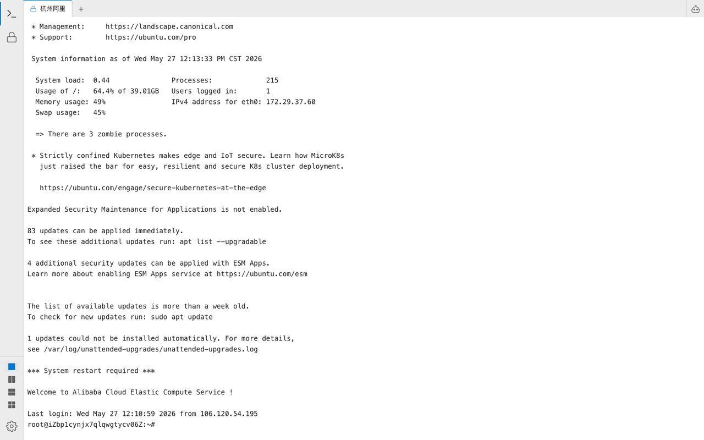

<div align="center">

[English version](README.md)

</div>

<div align="center">
  
  <h1>WinkTerm</h1>
  <p><strong>与你共享终端会话的 AI</strong></p>
  <p>不是一个只会建议命令的聊天机器人，而是在同一个 PTY 中与你并肩操作的协作者。</p>
</div>

<br>

<div align="center">

[](LICENSE)
[](https://github.com/Cznorth/winkterm)
[](docker-compose.yml)
[](https://github.com/Cznorth/winkterm)
[](https://star-history.com/#Cznorth/winkterm&Date)
[](https://github.com/Cznorth/winkterm)
[](https://twitter.com/intent/tweet?text=WinkTerm%20-%20AI%20that%20shares%20your%20terminal%20session&url=https://github.com/Cznorth/winkterm)
[](assets/promo.mp4)
[](https://dev.to/cznorth/winkterm-ai-that-shares-your-terminal-session-not-just-command-suggestions-8p9)
[](https://codespaces.new/Cznorth/winkterm)

</div>

<p align="center">
  <a href="#-demo">演示</a> •
  <a href="#-features">功能特性</a> •
  <a href="#-agent-api-亮点">Agent API</a> •
  <a href="#-quick-start">快速开始</a> •
  <a href="#-why-winkterm">为什么选择 WinkTerm？</a> •
  <a href="#-architecture">架构</a> •
  <a href="#-configuration">配置</a> •
  <a href="#-development">开发</a> •
  <a href="#-roadmap">路线图</a>
</p>

---

## 🎬 演示



*GIF — 真实 SSH：先敲错命令（`ipconfig`），再 `# what's wrong`，AI 在同一 PTY 里回复并可预填修复命令。*

[▶️ 观看宣传视频](assets/promo.mp4)

*宣传视频 — 单栏多 SSH 标签；Craft 跨主机编排（`list_ssh_connections`、`terminal_exec`、`ssh_run`）。*

```
$ ipconfig
Command 'ipconfig' not found, did you mean: ...
$ # what's wrong
[WinkTerm] `ipconfig` 是 Windows 命令 —— Linux 上请用 `ip addr`（或 `ifconfig`）。
$ ip addr█   ← AI 写入的。按回车执行。退格修改。Ctrl+C 取消。
```

**这不是一个套在终端里的 ChatGPT。**
AI 直接写入你的终端输入行。你始终掌控一切 — 按回车执行、自由编辑、或取消。就像在 SSH 到服务器时，身边坐着一位懂技术的搭档，能直接伸手帮你打字。

---

## ✨ 功能特性

- **共享 PTY 会话** — AI 和用户在同一个终端进程中操作。无需复制粘贴，没有脱离上下文的"运行这个命令"。
- **终端内对话** — 在 shell 提示符处直接输入 `#` 加你的问题，无需切换窗口。
- **侧边栏 AI 面板** — 完整的对话界面，支持多对话标签、AI 自动生成标题，以及 chat/craft 模式切换。
- **对话历史持久化** — 会话写入 `~/.winkterm/chat_history.json`，页面加载时自动恢复；WS 重连与后端重启不丢记录。
- **流式输出可续传** — 回复过程中刷新或重连不会丢已生成内容；服务端跟踪进行中的流并向新 WS 回放。
- **流式排队与续接建议** — AI 回复过程中可排队后续消息（随时打断或移除队列项），每次回答结束后给出一键续接建议 chips。
- **外部 Agent 接入** — 带鉴权的 HTTP 接口，外部 agent 可通过可安装的 skill 操作你的终端、SSH 与文件传输（详见下方 Agent API 亮点）。
- **Agent 终端即主界面标签** — Agent 创建的会话以普通终端 tab 展示（不再有独立监控面板）。`GET /api/sessions/stream` 同步标签栏；WS 断开不再关闭 PTY，刷新后回放缓冲输出。
- **Web 远程访问鉴权** — 远程网页访问由访问密钥保护，本机桌面客户端免鉴权。
- **SSH 远程连接** — 连接远程服务器，内置文件传输功能。编辑连接时密码留空则保留已保存的凭据。
- **配置导出与安全保存** — 设置页可导出完整 `config.json`（`GET /api/settings/export`）。保存时密码/API Key 留空不会清空已有密钥。
- **终端稳定性** — PTY 尺寸防抖修复 PowerShell prompt 截断；Agent 批量建 tab 不再空显示；WS 静默重连（不写断开提示行，避免 PSReadLine 光标错乱）。
- **国际化** — 内置中英文界面，首次启动时选择语言。
- **多模型支持** — 自带 LLM。OpenAI、Anthropic、Ollama 或任何兼容 OpenAI 协议的端点。
- **Docker 与桌面应用** — 通过 `docker compose up` 一键部署，或打包为独立桌面应用（Windows/macOS）。

---

## 🤖 Agent API 亮点

WinkTerm 不只是给人用的终端，它的 HTTP Agent API 是为 AI agent（Claude Code、Cursor 等）量身设计的远程操作接口。

### 接口设计

| 端点 | 用途 |
|------|------|
| `POST /api/agent/terminals/{id}/exec` | **原子执行**：返回 stdout + 真实 `exit_code` + 当前 `cwd`。sentinel 标记自动剥离命令回显和 prompt。支持 `cwd` / `env` subshell 注入（不污染终端持久状态）。 |
| `POST /api/agent/ssh/{conn_id}/run` | **一次性 SSH 执行**：自动 create → exec → close 三步合一，省掉 3 次 HTTP 调用。 |
| `POST /api/agent/terminals/{id}/input` | **命名控制键**：`{"keys": ["ctrl+c"]}` 替代 JSON 里塞控制字符。支持 `data_b64` 输入避开多层引号嵌套地狱。 |
| `GET /api/agent/terminals/{id}/snapshot?pattern=...` | **服务端 grep**：在 256KB 缓冲里按正则匹配，省下载。 |
| `GET /api/agent/terminals/{id}/stream` | **SSE 实时输出流**：长命令监控 / `tail -f` 杀手锏，断线 `since` 续传。 |
| `GET /api/agent/events/stream` | **操作事件流**：每个 agent 动作都记录到环形缓冲（无持久化），SSE 实时推送。 |
| `GET /api/sessions` / `GET /api/sessions/stream` | **会话生命周期**：列出用户可见终端；SSE 推送 `session_created` / `session_closed`，与前端标签栏同步。 |
| `GET /api/chat/conversations` | **对话持久化**：列出已保存的侧边栏会话（同时落盘 `~/.winkterm/chat_history.json`）。 |
| `GET /api/settings/export` | **配置备份**：下载完整 `config.json`（本机或有效 `X-Access-Key`）。 |
| `GET /api/agent/handshake` | **零配置接入**：localhost 或带 web 鉴权 key 的远程客户端直接拿 token，agent 不必每次问用户。 |

### 关键设计

- **退出码可见**：调 exec 不用 grep 输出来判定成败，`exit_code` 直接返回。
- **30+ 命名键**：`ctrl+c` / `up` / `tab` / `esc` / `f1` 等，无需在 JSON 里写 ``。
- **base64 输入**：复杂 awk / jq / heredoc 命令一律走 `command_b64`，告别三层引号转义。
- **cwd 持久跟踪**：每次 exec 后 sentinel 上报 `$PWD`，前端面板显示终端当前所在目录。
- **TTL 自动回收**：终端默认 30 分钟空闲自动关闭，避免 agent 忘删导致泄漏。
- **wait reason 字段**：区分 `idle` / `timeout` / `no_output` 三种结束语义。

### 可安装的 skill

```bash
curl -s http://<your-winkterm-host>:8000/api/agent/skill.md > SKILL.md
```

把 SKILL.md 放到 Claude Code / Cursor / 任意 agent 工具的 skills 目录，AI 立即知道如何用本 API。Skill 自带版本号，agent 每次会话自动检查更新。

### 统一 Session 池

内部 craft agent 与外部 HTTP API 共用同一终端 session 池和工具集（`list` / `create` / `close` / `snapshot` / `input` / `exec` / `ssh_run`）。Agent 创建的终端对用户可见，直接在主界面以普通 tab 打开。订阅 `/api/sessions/stream` 可实时同步标签；`/api/agent/events/stream` 提供按操作类型着色的审计事件流。

### 实战案例

[📖 案例：AI agent 用 WinkTerm 30 分钟定位 + 清除 XMR 挖矿木马](docs/case-study-xmr-miner-cleanup.md)

真实事件复盘：用户只说"107.173 开头服务器负载很高"，AI agent 通过 Agent API 完成从发现 → 定位 → 还原入侵链 → 加固 → 上报 abuse 全流程。本次更新的 9 个新功能就是从这次案例的痛点反推出来的。

---

## 🔥 为什么选择 WinkTerm？

| 特性 | WinkTerm | Warp | Tabby | Claude Code |
|------|----------|------|-------|-------------|
| 共享 PTY（AI 在终端中打字） | ✅ | ❌ | ❌ | ❌ |
| 开源 | ✅ | ✅ | ✅ | ❌ |
| 自托管 / 自带 LLM | ✅ | ❌ | ❌ | ✅ |
| Web UI | ✅ | ✅ | ✅ | ❌（仅 CLI） |
| SSH + 文件传输 | ✅ | ❌ | ✅ | ❌ |
| 桌面应用 | ✅ | ✅ | ✅ | ❌ |

**WinkTerm 的核心理念**：终端是运维发生的地方。AI 应该活在终端*里面*，而不是旁边。当 AI 将命令写入你的输入行，你按下回车 — 这不是盲目信任，而是在审查、理解和选择。这就是协作运维。

---

## 🚀 快速开始

### Docker（最简方式）

```bash
docker run -p 3000:3000 -p 8000:8000 \
  -e ANTHROPIC_API_KEY=*** \
  ghcr.io/cznorth/winkterm:latest
```

或使用 docker-compose：

```bash
git clone https://github.com/Cznorth/winkterm.git
cd winkterm
cp .env.example .env
# 编辑 .env 填写你的 API Key
docker compose up -d
```

`docker-compose.yml` 将 `winkterm-data` 卷挂载到 `/root/.winkterm`，配置、对话历史、SSH 凭据在容器重建后仍保留；镜像内已打包可安装的 agent skill（拉取 `skill.md` 不会 404）。

然后打开 **http://localhost:3000**

### 桌面应用

从 [Releases 页面](https://github.com/Cznorth/winkterm/releases) 下载最新版本。

- **Windows**：`.exe` 安装包
- **macOS**：`.app` 安装包（Intel 和 Apple Silicon）。桌面版先启动内嵌后端再打开 WebView，静态资源不会误带开发环境的 `localhost:8000`。

---

## ⚙️ 配置

| 变量 | 说明 | 默认值 |
|------|------|--------|
| `ANTHROPIC_API_KEY` | Anthropic API key（必填） | — |
| `OPENAI_API_KEY` | OpenAI API key（备选） | — |
| `MODEL_NAME` | 使用的模型 | `claude-sonnet-4-20250514` |
| `OPENAI_BASE_URL` | 自定义 API 端点 | — |
| `AGENT_RECURSION_LIMIT` | Agent 递归限制 | `100` |
| `PROMETHEUS_URL` | Prometheus 端点 | `http://localhost:9090` |
| `LOKI_URL` | Loki 端点 | `http://localhost:3100` |
| `DEBUG` | 启用调试模式 | `false` |

> **自带 LLM**：WinkTerm 使用兼容 OpenAI 的协议。将 `OPENAI_BASE_URL` 设置为任意提供商（Ollama、vLLM、Groq、OpenRouter 等），WinkTerm 即可使用。

---

## 🏗 架构

```
用户键盘输入
    │
    ▼
前端终端 (xterm.js)
    │  WebSocket
    ▼
ws_handler.py
    │
    ├── 普通输入 ──► pty_manager.write() ──► shell 进程
    │
    └── 以 # 开头的行 ──► 拦截 ──► Agent (LangGraph)
                                                    │
                                                    ├── get_terminal_context()
                                                    ├── terminal_input()
                                                    └── write_command() ──► pty ──► 终端输入行
```

**关键洞察**：AI 消息直接写入 PTY 输出流，因此会无缝显示在你的终端中。无需独立的 UI 界面，无需上下文切换。

### 技术栈

| 层 | 技术 |
|-----|------|
| 后端 | Python + FastAPI + LangGraph + LangChain |
| 前端 | Next.js 14 + TypeScript + xterm.js |
| 无数据库 | `~/.winkterm/config.json` + `chat_history.json` 落盘 |
| 部署 | Docker Compose / PyInstaller 桌面应用 |

---

## 🛠 开发

### 前置要求

- Python 3.12+
- Node.js 20+
- Docker（可选）

### 后端

```bash
cd backend
python -m venv .venv
source .venv/bin/activate  # Windows: .venv\Scripts\activate
pip install -r requirements.txt
python -m uvicorn backend.main:app --reload --port 8000
```

### 前端

```bash
cd frontend
npm install
npm run dev
```

打开 http://localhost:3000

### 前端自测

在 **Cursor** 中优先用内置浏览器 MCP 访问 `http://localhost:3000`（点击 `.xterm-screen`，用 CDP 读 `.xterm-rows`）。其他环境用 `puppeteer-core` + 系统 Chrome，完整冒烟清单与 agent HTTP curl 示例见 [CLAUDE.md](CLAUDE.md)。

### README 素材录制（维护者）

需本地前后端、系统 Chrome、`ffmpeg`，并读取 `~/.winkterm/config.json`（主题、语言、SSH 连接）。

```bash
cd scripts && npm install
node record-readme-normal.mjs   # → assets/demo.gif
node record-promo-normal.mjs    # → assets/promo.mp4
node capture-og-image.mjs       # → assets/og-image-social.png（来自 demo 终帧）
```

已有帧只想放慢 GIF：`REBUILD_GIF_ONLY=1 GIF_FRAME_SEC=1.4 node record-readme-normal.mjs`

### API 类型（orval）

```bash
# 确保后端已启动
cd frontend
npm run gen:api
```

---

## 🗺 路线图

- [ ] Vim/Neovim 集成（AI 在缓冲区中写入）
- [ ] 终端录制与回放（类似回放）
- [ ] 多 Agent 编排（并行操作）
- [ ] 自定义工具的插件系统
- [ ] 原生 tmux 集成
- [ ] Kubernetes 上下文感知

---

## 🤝 参与贡献

欢迎贡献！请参阅 [CONTRIBUTING.md](CONTRIBUTING.md) 了解指南。

**适合初次 PR 的想法：**
- 改进错误消息和边界情况处理
- 添加更多 Agent 工具（kubectl、docker、git 辅助工具）
- 编写测试（后端测试覆盖不足）
- 改进 xterm.js 主题/配色方案
- 添加 Agent 提示词的语言支持

---

## 🔗 友情链接

- [LinuxDo](https://linux.do) —— 新的、好的网络社区

---

## 📄 许可证

[MIT](LICENSE) © 2026 Cznorth

---

## 🌐 多语言

- [English](README.md)
- [中文](README.zh-CN.md)（当前）

---

<div align="center">
  <p>由 <a href="https://github.com/Cznorth">Cznorth</a> 用 ❤️ 制作</p>
  <p>
    <a href="https://github.com/Cznorth/winkterm/issues">报告 Bug</a> •
    <a href="https://github.com/Cznorth/winkterm/discussions">讨论</a> •
    <a href="https://star-history.com/#Cznorth/winkterm&Date">Star 历史</a> •
    <a href="https://twitter.com/intent/tweet?text=WinkTerm%20-%20AI%20that%20shares%20your%20terminal%20session&url=https://github.com/Cznorth/winkterm">分享到 Twitter</a>
  </p>
</div>
