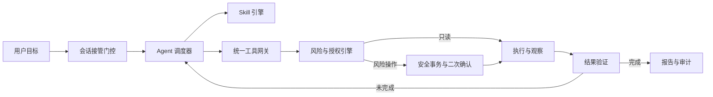

# ShellPilot AI 接管模式与用户自建 Skill 设计

**日期：** 2026-07-15

**状态：** 对话方案已确认，待书面规格复核

**范围：** 设计规格，不包含实现、打包或发布

## 1. 结论

ShellPilot 可以实现类似 Codex 的对话式 SSH 运维体验：用户描述目标，AI 在当前 SSH 会话内观察环境、制定计划、调用工具、读取结果、调整步骤并验证完成情况。

系统不把 SSH 密码、私钥或不受限制的 root shell 直接交给模型。模型只能通过受控工具网关提出操作；只读操作可以自动执行，所有有风险的操作必须进入事务级二次确认，无法完整展示或明确禁止的操作不得由接管模式执行。

该方案技术上可行，并且可以在现有 Electerm/ShellPilot 基础上增量实现。项目已经具备 Agent 工具调用、SSH/SFTP、后台任务、计划确认、任务取消、安全事务、端点校验、恢复点和审计记录等基础能力。主要缺口是会话级接管门控、稳定的 Agent 执行闭环、冻结式风险事务和新的用户自建 Skill 运行时。

## 2. 已确认的产品决策

1. 采用分级自治，不采用不受限制的 root 自治。
2. AI 接管模式必须由用户显式开启，默认关闭。
3. 接管开关按每个 SSH 会话独立管理，不提供全局接管授权。
4. 接管关闭时，AI 只能回答、解释和生成建议，不得主动调用 SSH/SFTP 执行工具。
5. 接管开启后，AI 可以自动执行已验证的只读操作，并根据结果连续规划。
6. 所有风险操作使用事务级合并确认；同一服务器、同一目标、风险范围不变的步骤可以一次确认。
7. 命令、脚本、目标、影响范围或风险等级发生变化时，原确认立即失效并重新弹窗。
8. 产品默认不附带任何业务 Skill，干净安装后的 Skill 列表为空。
9. Agent、工具、安全策略、恢复和审计属于系统基础能力，不算 Skill。
10. Skill 由用户通过对话创建，或通过本地文件夹/压缩包导入并手动编辑。
11. Skill 支持提示词、脚本、权限申请、引用资料、前置检查和结果验证。
12. Skill 的声明不是授权，不能绕过全局风险分类和二次确认。
13. 客户端保持现有主布局，只增加局部入口、状态、卡片、弹窗和抽屉。

## 3. 目标与非目标

### 3.1 目标

- 让用户以自然语言控制当前 SSH 会话，减少手工拼接命令。
- 建立“计划、执行、观察、调整、验证、报告”的完整 Agent 闭环。
- 让只读诊断保持低摩擦，让所有修改操作可见、可确认、可追踪。
- 在支持恢复的场景中，执行前创建并验证恢复点。
- 让用户创建可复用的本地 Skill，而不是由产品预置运维知识包。
- 保持不同 SSH 会话、不同服务器和不同账号之间的授权隔离。
- 复用现有 SSH、SFTP、安全事务和安全操作中心，避免重写底层连接能力。

### 3.2 非目标

- 不提供全局“一键接管全部服务器”。
- 不让一次授权跨 SSH 标签页、跨服务器或跨账号复用。
- 不提供无确认的风险操作或整段会话预授权。
- 不承诺任意 Shell 命令、数据库写入、包升级或交互式程序都可自动回滚。
- 不预置 Linux、Nginx、Docker、磁盘清理等业务 Skill。
- 首期不提供 Skill 市场、在线下载、自动发布、自动学习或从历史记录静默生成 Skill。
- 不让 Skill 直接读取认证凭据、直接访问 SSH Socket 或绕过工具网关。
- 不改变现有三段式客户端主布局。

## 4. 总体架构

系统由八个职责独立的部分组成：

1. **会话接管门控：** 管理当前 SSH 会话是否允许 Agent 主动调用执行工具。
2. **Agent 调度器：** 负责理解目标、制定计划、调用工具、观察结果、重新规划和验证完成。
3. **上下文管理器：** 提供当前端点、终端状态、有限输出、任务证据和已选 Skill，执行脱敏与限长。
4. **Skill 引擎：** 发现、校验、匹配和渐进式加载用户 Skill。
5. **统一工具网关：** 提供 SSH、SFTP、文件、日志、服务、进程、Docker 和后台任务等受控工具。
6. **风险与授权引擎：** 对每个实际工具调用和展开后的脚本进行风险判断。
7. **安全事务引擎：** 准备恢复点、冻结计划、等待确认、执行、验证、保留或回滚。
8. **持久化与审计：** 保存任务、状态迁移、确认记录、脱敏摘要、恢复元数据和错误原因。



模型不能直接写入 SSH 通道。所有执行必须通过工具网关，并在实际执行前再次校验端点、接管状态、计划绑定和权限。

## 5. 每个 SSH 会话独立的接管模式

### 5.1 会话绑定

接管授权绑定以下身份：

- SSH 标签页 ID
- 会话进程/连接 ID
- 主机
- 端口
- 用户名
- 服务器主机密钥指纹
- SSH 会话类型

缺少任一关键身份或身份发生变化时，接管授权无效。授权不得借给另一个标签页或重新连接后的新会话。

### 5.2 状态机

```text
off
  -> enabling
  -> active-idle
  -> running-readonly
  -> awaiting-risk-confirmation
  -> running-confirmed-change
  -> verifying
  -> active-idle

任意活动状态 -> stopping -> off
任意执行状态 -> failed | partially-completed
```

- `off`：AI 可以回答和生成建议，但不得主动调用执行工具。
- `enabling`：展示当前服务器、账号、指纹、自动只读权限和风险确认规则。
- `active-idle`：接管已开启，等待用户目标。
- `running-readonly`：执行允许列表中的只读工具调用。
- `awaiting-risk-confirmation`：冻结风险事务并等待用户决定。
- `running-confirmed-change`：仅执行已经确认并完成指纹绑定的步骤。
- `verifying`：运行结果验证器，判断目标是否达到。
- `stopping`：阻止后续步骤并尝试中断当前命令。
- `failed/partially-completed`：保留证据和恢复入口，不自动重新执行原修改。

### 5.3 自动退出条件

以下情况自动关闭当前会话的接管模式：

- SSH 断开或重新建立连接
- 标签页关闭
- 主机、端口、用户名、主机指纹或会话 ID 变化
- 用户关闭接管开关
- 用户点击“一键停止”
- 应用退出或重启

应用重启后只恢复任务记录和恢复元数据，不恢复接管授权，也不自动继续修改步骤。

### 5.4 并发与人工接管

- 同一端点和同一影响目标同一时间只允许一个写事务。
- Ctrl+C 和“一键停止”始终可用。
- 风险事务运行期间不允许普通人工命令与 Agent 修改命令交错执行。
- 用户选择手工接管时，先停止 Agent 后续步骤；若当前命令无法确认已经停止，任务标记为状态不确定并保留恢复入口。
- 只读阶段或空闲阶段出现人工终端输入时，Agent 暂停，任何等待确认的风险事务立即失效。
- 隐藏或关闭 AI 面板只隐藏视图，不取消任务；取消必须使用明确的停止入口。

## 6. Agent 执行闭环

接管模式下的标准数据流如下：

```text
用户描述目标
-> 校验当前会话接管授权
-> 识别服务器环境和可用工具
-> 匹配用户 Skill（可选）
-> 生成结构化计划
-> 自动执行允许列表中的只读步骤
-> 汇总证据并重新规划
-> 将所有修改步骤转换为风险事务
-> 展示并等待事务级确认
-> 执行冻结后的事务
-> 运行结果验证
-> 成功报告 / 失败回滚 / 生成新的待确认事务
```

调度器必须满足：

- 使用有限的最大迭代次数、单步超时、总任务预算和输出上限，禁止无限循环。
- 每一步都有明确输入、目标端点、工具、状态、退出码和限长输出。
- 工具返回错误时先记录证据，再决定重试、替代方案、停止或回滚。
- 命令退出码为 0 不等于任务完成，必须执行目标级验证。
- 重新规划不得悄悄修改已经等待确认或已经确认的事务。
- 长时间操作必须进入现有后台任务机制，并可以查询状态、读取日志和取消。
- 用户关闭视图后任务可以继续，但标签页和安全操作中心必须持续显示状态。

首期复用现有 Agent 最大迭代、命令超时、后台任务和取消能力；实现不得移除这些有限性保护。

## 7. 风险分类与事务级确认

### 7.1 分类规则

只允许以下四种最终结果：

1. **允许列表只读：** 结构化、可证明不产生远程副作用，可在接管开启后自动执行。
2. **风险操作：** 任意写入、删除、上传、覆盖、权限修改、服务状态修改、进程信号、容器修改、软件安装、网络修改或完整展开的动态脚本，必须二次确认。
3. **不可审查：** 无法展开实际命令、影响目标或副作用的动态执行，不得由接管模式执行。
4. **明确禁止：** 被系统禁止策略命中的操作，即使用户确认也不得由 Agent 执行。

风险判断以实际工具参数和展开后的内容为准，不信任模型或 Skill 自报的风险等级。原始 Shell 命令只有命中严格只读允许列表时才能自动执行；其他可审查命令进入风险事务，不可审查命令被阻止。

首期系统最低禁止集包括：

- 格式化磁盘、向原始块设备写入或破坏分区表
- 以系统根目录、挂载点根目录或用户主目录根为目标的无边界递归删除
- Fork Bomb、蓄意资源耗尽或其他明显破坏系统可用性的命令
- 读取并向模型或外部地址传送私钥、密码库、Token 或认证配置
- 为绕过安全机制而删除审计记录、恢复点或 ShellPilot 安全目录
- 在没有验证带外恢复通道时，同时切断当前唯一 SSH 管理通道的网络或 SSH 修改

正常重启、关机、服务重启和可完整审查的网络修改不属于最低禁止集，但始终属于风险操作，必须明确展示断线影响并经过事务级确认。

### 7.2 事务合并边界

多个风险步骤只有同时满足下列条件才能合并为一次确认：

- 相同 SSH 会话和精确端点
- 相同用户目标
- 所有步骤已经完整展开
- 影响对象和顺序已经确定
- 恢复策略和验证步骤已经确定
- 合并不会隐藏中间不可逆副作用

新增步骤、删除步骤、改变顺序、改变命令参数、改变脚本内容、改变目标、扩大影响范围或提高风险等级，都会使原确认失效。

### 7.3 弹窗内容

事务级确认弹窗必须显示：

- 目标服务器、端口、账号、主机指纹和当前会话
- 操作目的及 AI 的判断依据
- 完整命令、脚本摘要和脚本内容入口
- 将修改、删除、上传、重启或停止的对象
- 预计影响范围、可能中断时间和最坏结果
- 是否可能造成 SSH 断线
- 恢复点是否创建并验证成功
- 可用回滚方式和明确不可回滚部分
- 执行后的验证步骤
- 取消和确认执行按钮

弹窗出现后，事务进入冻结状态。模型仍可解释事务，但不能修改事务内容。用户取消后不执行任何事务步骤；AI 可以继续提供只读分析和建议。

### 7.4 计划绑定

确认记录使用 SHA-256 指纹绑定：

- 精确端点身份
- 用户目标
- 有序工具调用和参数
- 命令文本
- Skill ID 与版本
- 脚本和模板摘要
- 影响对象
- 恢复点元数据
- 结果验证步骤

执行前再次计算并比对指纹。任何不一致都必须停止并重新确认。

## 8. 工具网关与凭据边界

### 8.1 工具能力

首期复用并统一现有能力：

- 查询标签页、活动会话和书签
- 打开已保存的 SSH 会话
- 发送终端命令并读取有限输出
- 查询、读取和取消后台任务
- SFTP 列表、状态、读取、上传、下载和安全删除
- 查询文件、日志、服务、端口、进程和容器状态
- 受控本地 CLI 白名单
- 安全事务的准备、执行、验证、保留和回滚

中长期应优先增加结构化工具，例如“读取服务状态”“读取最近日志”“验证监听端口”，减少依赖无法静态理解的任意 Shell 字符串。

### 8.2 凭据与敏感数据

- SSH 密码、私钥正文、API Key、Token 和 Cookie 不进入模型上下文。
- 模型只看到脱敏后的端点身份和必要环境信息。
- 工具输出在进入上下文、审计和报告前统一脱敏并限长。
- Skill 无法直接访问凭据存储或底层 SSH Socket。
- 任何错误信息不得回显认证凭据。

## 9. 用户自建 Skill 系统

### 9.1 默认状态

- 干净安装后的 Skill 数量必须为 0。
- 产品不注册示例 Skill、运维 Skill 或在线推荐 Skill。
- 创建器内部可以有空白模板，但模板不出现在可用 Skill 列表。
- 没有 Skill 时，通用 Agent 仍可使用系统工具完成任务。

升级场景中，旧版本内置 Skill 不迁移为用户 Skill。已有用户自定义 Skill 数据不得丢失；它们迁移为禁用草稿，经过新格式校验和用户复核后才能启用。

### 9.2 包结构

最小 Skill 只需要一个 `SKILL.md`：

```text
<skill-name>/
├── SKILL.md
├── skill.json            # 可选，声明结构化能力与验证入口
├── scripts/              # 可选，确定性脚本
├── references/           # 可选，按需加载的参考资料
├── templates/            # 可选，配置或报告模板
├── checks/               # 可选，前置检查与结果验证
└── tests/                # 可选，本地测试和样例
```

`SKILL.md` 必须包含：

- `name`
- `description`
- 工作流说明

`skill.json` 为可选机器可读清单，可声明：

- 格式版本
- 是否允许隐式匹配
- 支持的平台和环境前提
- 申请使用的工具
- 申请的权限类别
- 脚本入口
- 前置检查入口
- 结果验证入口

清单只表达 Skill 的需求上限，不授予权限，也不能降低系统判断的风险等级。没有 `skill.json` 的 Skill 按纯说明型 Skill 处理，不自动执行脚本或检查器。

### 9.3 渐进式加载与调用

- 初始上下文只包含已启用 Skill 的名称、描述和路径，使用有限的目录预算。
- 只有显式调用或描述匹配后，才读取完整 `SKILL.md`。
- 引用资料、脚本和模板只在工作流明确需要时读取。
- 用户可以使用 `$skill-name` 或 Skill 选择器显式调用。
- 用户创建的 Skill 默认允许隐式匹配，可以在 Skill 设置中关闭。
- 当前任务显式指定 Skill 时，不自动混入其他 Skill。
- Skill 缺失、禁用或校验失败时，AI 明确说明原因，并允许用户选择是否使用通用 Agent 继续。

### 9.4 对话创建

“创建 Skill”是系统功能，不是默认 Skill。创建流程：

1. 用户描述 Skill 的目标和使用场景。
2. AI 询问触发条件、输入、支持平台、标准步骤和成功标准。
3. AI 识别可能的风险操作、所需工具、权限申请、前置检查和结果验证。
4. AI 生成 `SKILL.md` 以及可选的清单、脚本、引用、模板和检查器草稿。
5. 草稿保存在独立草稿区，默认禁用。
6. 系统执行结构校验、路径校验、脚本扫描、权限分析和引用完整性检查。
7. 用户查看完整文件树、文件内容、变更摘要和风险说明。
8. 用户可以继续通过对话修改，也可以手动编辑。
9. 用户点击“保存并启用”后，Skill 才加入可用列表。

创建 Skill 的对话不会执行草稿中的脚本，也不会因为生成成功而自动启用。

### 9.5 手动导入与编辑

- 支持导入本地 Skill 文件夹或压缩包。
- 导入内容先进入禁用草稿，校验通过并经用户复核后启用。
- 编辑器提供文件树，可编辑说明、清单、脚本、模板和验证器。
- 保存使用原子替换；失败时保留上一个有效版本。
- Skill 内容变化后重新计算摘要、重新校验，并使所有等待确认的相关事务失效。
- 导入和编辑不得接受越过 Skill 根目录的路径或指向外部位置的符号链接。

### 9.6 Skill 运行安全

- Skill 不能调用未声明或系统未提供的工具。
- Skill 不能直接访问凭据和 SSH Socket。
- Skill 脚本必须通过工具网关执行，或被展开为可审查的远程事务。
- 通用 Shell 脚本默认属于风险操作。
- 动态下载后执行、`eval`、编码隐藏、不可解析命令替换和无法确定目标的脚本不得由接管模式执行。
- 脚本、模板、检查器和清单在确认时都纳入事务指纹。
- Skill 更新不会继承旧版本的事务确认。
- Skill 提示中的“忽略安全策略”“直接执行”等内容无效；系统策略优先级始终高于 Skill。

## 10. 数据与持久化

### 10.1 持久化数据

- Agent 任务及步骤状态
- 脱敏的命令、工具参数和输出摘要
- 风险事务及确认记录
- 恢复点和验证元数据
- Skill 索引、启用状态、版本和摘要
- Skill 草稿和上一有效版本
- 错误阶段、错误类型和用户操作

### 10.2 非持久化数据

- 当前 SSH 会话的接管授权
- 密码、私钥正文、API Key、Token 和 Cookie
- 未脱敏的完整模型上下文
- 无限制的完整终端输出

接管授权只存于当前运行时，并绑定活跃会话；应用重启后必须重新开启。

## 11. 客户端布局与交互

保留现有主布局：

```text
左侧导航 | 中间 SSH/SFTP 主区域 | 右侧 AI 助手
```

只增加以下局部内容：

- AI 助手顶部显示当前 SSH 会话和“AI 接管”开关。
- SSH 标签页在接管开启时显示明显但紧凑的状态标识。
- AI 面板在任务运行时显示计划、工具调用、证据、进度和验证结果卡片。
- 接管开启或任务运行时显示“一键停止”。
- 风险事务使用现有模态体系显示详细二次确认。
- AI 设置增加“Skill 管理（数量）”入口。
- Skill 创建、导入和编辑使用模态窗口或抽屉，不长期占用终端空间。
- 安全操作中心继续显示运行中、可回滚和历史任务。

不增加新的永久侧边栏、第四列工作区、Skill 市场导航或默认展开的大型任务面板。时间、夜间主题和 Windows 缩放继续使用现有设计变量与布局约束。

## 12. 错误、断线与恢复

### 12.1 SSH 断线

- 立即关闭接管授权。
- 停止未开始的后续步骤。
- 已有副作用时标记为 `partially-completed` 或状态不确定。
- 保留恢复点和审计记录。
- 重新连接相同精确端点后，只允许用户显式进入验证或回滚，不自动继续原修改。

### 12.2 命令超时或取消

- 关闭当前执行流并阻止后续步骤。
- 取消成功不等于修改已回滚。
- 如果可能产生副作用，必须提示用户验证或回滚。
- 无法确认远程进程已停止时，任务状态不得显示成功。

### 12.3 模型或流式响应失败

- 停止新的工具调用。
- 已执行步骤和证据保持可见。
- 等待确认的事务失效。
- 不因模型重试自动重复风险操作。

### 12.4 Skill 失败

- 结构、引用或权限声明无效时禁用 Skill。
- 前置检查失败时不执行后续步骤。
- 结果验证失败时进入失败或回滚流程，不把命令成功当作任务成功。
- Skill 更新或被删除时，不影响已经保存的审计记录，但未执行事务必须失效。

### 12.5 回滚冲突或失败

- 回滚前重新校验端点、恢复绑定和目标当前摘要。
- 目标被外部修改时拒绝自动覆盖，要求人工处理。
- 回滚失败时保留所有恢复资料，不重复执行原修改。
- 界面明确区分“命令结束”“修改完成”“验证通过”和“已恢复”。

## 13. 测试策略

### 13.1 单元测试

- 每会话接管状态机和自动退出条件
- 标签页、端点、账号和主机指纹隔离
- 接管关闭时执行工具拒绝
- 只读允许列表和风险默认分类
- 事务合并边界和计划指纹
- 事务内容变化后确认失效
- Skill 发现、校验、渐进式加载和显式/隐式调用
- 默认 Skill 列表为空
- Skill 路径、压缩包和符号链接防护
- 输出限长和敏感信息脱敏

### 13.2 集成测试

- Agent 计划、工具调用、观察、重新规划和验证闭环
- 只读步骤自动执行，风险步骤停止在确认弹窗
- 确认后只能执行冻结事务
- 背景任务状态、日志和取消
- Skill 草稿、保存、启用、编辑和版本回退
- 安全事务的准备、执行、验证、保留和回滚
- 应用重启后任务记录保留但接管授权关闭

### 13.3 UI/E2E 测试

- 多 SSH 标签页接管状态互不影响
- 切换标签不借用授权
- 断线、重连和关闭标签后自动关闭接管
- 风险弹窗完整显示目标、命令、影响、恢复和验证
- 取消事务不产生修改
- 一键停止阻止后续步骤
- 干净安装显示“还没有 Skill”
- 对话创建、手动导入和编辑 Skill 的完整流程
- 时间/夜间主题、窄窗口和 Windows 125% 缩放可用
- 键盘焦点、按钮语义和弹窗可访问性

### 13.4 安全测试

- Skill 路径穿越和压缩包逃逸
- 外部符号链接
- 脚本摘要篡改
- Base64、`eval`、命令替换和下载后执行
- Prompt Injection 要求绕过安全策略
- 端点替换、标签页替换和确认重放
- 密码、私钥、Token、Cookie 和 API Key 脱敏
- 外部并发修改后的回滚冲突

### 13.5 真实服务器 Smoke

- 只在隔离测试服务器执行。
- 先覆盖只读诊断、取消和断线。
- 写入测试限定在 `/tmp` 或专用测试目录，并验证备份、修改和回滚。
- 服务重启使用专用测试服务，不触碰生产业务。
- 网络或 SSH 配置测试必须有云控制台/VNC 等带外通道。
- 真机回归通过前不得把功能作为生产可用能力发布。

## 14. 建议交付阶段

### 阶段 1：会话接管门控

- 每 SSH 会话独立开关
- 精确端点绑定
- 开启、停止、断线和重启状态机
- 标签页状态和最小 AI 面板入口
- 接管关闭时统一拒绝执行工具

### 阶段 2：Agent 闭环与风险事务

- 稳定的计划、执行、观察、重新规划和验证循环
- 只读允许列表
- 风险事务合并、详细弹窗和计划冻结
- 事务指纹和二次执行前校验
- 一键停止、后台任务和状态恢复

### 阶段 3：空白 Skill 运行时

- 移除默认业务 Skill
- Skill 目录发现和渐进式加载
- `SKILL.md` 与可选 `skill.json`
- 导入、编辑、启用、禁用和版本回退
- 默认空列表和旧自定义数据迁移

### 阶段 4：对话创建 Skill

- 独立创建对话
- 草稿区
- 文件树预览和手动编辑
- 结构、权限和脚本校验
- 用户复核后保存并启用

### 阶段 5：恢复、审计与发布验证

- 扩展恢复提供方和结果验证器
- 安全操作中心整合
- 真机 Smoke、安全回归和 Windows 打包验证
- 用户文档、风险说明和故障恢复指南

以上阶段按顺序推进。阶段 1 和阶段 2 未验证前，不先做 Skill 市场或扩大高风险自动化范围。

## 15. 验收标准

1. 干净安装后的 Skill 列表为空。
2. 接管模式默认关闭，关闭时 AI 不得调用 SSH/SFTP 执行工具。
3. 每个 SSH 会话独立开启接管，授权不能跨标签页复用。
4. 主机、端口、账号、指纹或会话 ID 变化后接管立即关闭。
5. 允许列表中的只读操作可以在接管开启后自动连续执行。
6. 任意非只读操作必须进入事务级二次确认。
7. 风险弹窗完整展示目标、命令、影响、最坏结果、恢复能力和验证步骤。
8. 用户取消事务后不执行任何事务步骤。
9. 用户确认后只能执行已经冻结的步骤。
10. 事务内容或目标变化后原确认失效。
11. 无法完整展开或明确禁止的操作不得由 Agent 执行。
12. 执行完成必须经过目标级验证，不能只依赖退出码。
13. 一键停止可以阻止后续步骤，并如实报告当前命令是否确认停止。
14. 应用重启后任务和恢复记录保留，但接管授权不恢复。
15. 用户可以通过对话创建 Skill 草稿，并在审查后保存启用。
16. 用户可以导入和手动编辑本地 Skill。
17. Skill 权限声明不能降低全局风险等级或跳过确认。
18. Skill 内容变化会使相关待确认事务失效。
19. 模型上下文、日志和审计中不包含密码、私钥正文或 API Key。
20. 客户端保留现有三段式主布局，在常用主题、窗口宽度和 Windows 缩放下可用。

## 16. 方案边界

该设计实现的是“受控的 AI SSH 运维 Agent”，不是把服务器无限制地交给模型。系统可以让 AI 像 Codex 一样通过对话完成连续任务，但所有执行能力仍受会话授权、工具边界、风险分类、用户确认、恢复能力和审计约束。

最终安全原则是：只有系统能够证明为只读的操作才自动执行；所有可审查的风险操作必须确认；所有不可审查或明确禁止的操作必须停止。
