# ShellPilot Aurora UI 全量现代化设计

- 日期：2026-08-01
- 状态：视觉方向已获用户确认，等待书面规格复核
- 目标版本：当前仓库最新版本
- 目标平台：Windows 桌面端，兼顾现有 Web/Electron 布局能力

## 1. 目标

在不改变任何功能的前提下，为 ShellPilot 全部一级工作区建立统一、年轻、具有强阴影和明确立体层级的视觉系统。选定方向命名为 **Aurora Pop Workbench**：浅薰衣草白基底、靛蓝至紫色主色、偏移彩色阴影、圆润但专业的控件、清晰的深色文字，以及适度的薄荷绿状态色。

本设计只改变视觉表现。现有功能、入口、数据、流程、状态机和安全边界必须保持不变。

## 2. 硬约束：只优化 UI

允许的改动：

- 颜色、字体、字重、字号、行高。
- 间距、对齐、圆角、边框、阴影、背景和分隔线。
- 图标的颜色、尺寸、容器样式和选中态。
- 现有布局容器内部的纯展示排列，但不得改变交互路径或信息顺序。
- 为应用样式而增加 className、CSS 变量或不影响语义与事件的展示包装层。

禁止的改动：

- 新增、删除、合并、重命名或重排功能入口。
- 修改点击、双击、右键、拖拽、焦点、键盘、快捷键或滚轮行为。
- 修改业务逻辑、状态、数据结构、持久化、API、IPC、权限或安全确认流程。
- 修改 SSH、终端、SFTP、AI、运维工具、事务回滚或更新机制。
- 用预览图中的示例数据替换真实数据或空状态。
- 实现当前版本不存在的按钮、筛选器、指标、建议项、插图或操作。

如果预览图与当前功能结构冲突，以当前代码和现有交互为准；预览图只作为视觉语言和信息层级参考。

## 3. 视觉系统

### 3.1 色彩令牌

| 角色 | 浅色主题 | 深色主题 | 用途 |
| --- | --- | --- | --- |
| `--sp-canvas` | `#F6F7FF` | `#0B1020` | 应用主背景 |
| `--sp-surface` | `#FFFFFF` | `#11182A` | 主面板、弹窗、侧栏 |
| `--sp-surface-soft` | `#F0F2FF` | `#171F35` | 次级区域、悬停背景 |
| `--sp-text` | `#111B3F` | `#EDF1FF` | 主文字 |
| `--sp-text-muted` | `#69708E` | `#9CA6C4` | 次级文字 |
| `--sp-primary` | `#4D46F5` | `#746DFF` | 主操作、选中态 |
| `--sp-primary-2` | `#6C63FF` | `#8A82FF` | 渐变与高光 |
| `--sp-cyan` | `#149BD7` | `#2CB7EB` | 次级强调 |
| `--sp-success` | `#20B66A` | `#32D583` | 在线、完成、安全 |
| `--sp-warning` | `#F2A11D` | `#F7B84B` | 告警、待处理 |
| `--sp-danger` | `#E5484D` | `#FF6B70` | 现有错误与危险状态 |
| `--sp-border` | `#DDE1F3` | `#28334F` | 边框与分隔线 |

现有语义颜色不改变含义。红色不得被用作普通装饰色。

### 3.2 阴影与层级

```css
--sp-shadow-sm: 0 4px 10px rgba(62, 58, 160, 0.10);
--sp-shadow-md: 0 10px 24px rgba(73, 66, 196, 0.16);
--sp-shadow-lg: 0 18px 42px rgba(75, 66, 202, 0.22);
--sp-shadow-focus: 0 8px 18px rgba(77, 70, 245, 0.28);
--sp-highlight: inset 0 1px 0 rgba(255, 255, 255, 0.82);
```

层级规则：

1. 页面底层不加阴影。
2. 主工作区、打开的侧栏和大型弹窗使用 `lg`。
3. 工具栏、主按钮、选中对象使用 `md` 或 `focus`。
4. 普通表格行、日志行、文件行保持扁平，仅使用分隔线。
5. 禁止卡片套卡片和每行一张重阴影卡片。

深色主题沿用同一层级，阴影改为黑色基底加轻微紫色外辉，不扩大模糊半径。

### 3.3 圆角、间距与排版

- 小控件圆角：8px。
- 输入框、按钮、标签页：10px。
- 工具栏、列表容器：14px。
- 主面板、侧栏、大型弹窗：18px。
- 基础间距单位：4px；常用间距：8、12、16、24、32px。
- 中文 UI 字体优先沿用当前字体配置；默认视觉基准为 HarmonyOS Sans SC / Inter / 系统无衬线回退。
- 正文 14px，主要控制标签 14px，辅助文本 12px 至 13px，页面标题 28px 至 32px。
- 终端和日志继续使用现有等宽字体设置，不覆盖用户配置。

### 3.4 控件状态

- Hover：背景色轻微抬升，阴影从 `sm` 过渡到 `md`，不得移动布局。
- Active：使用轻微内阴影或 1px 下压视觉，不改变点击逻辑。
- Focus：保留清晰的 2px 焦点环，键盘导航顺序不变。
- Disabled：降低对比度但保持文字可读，不隐藏控件。
- Selected：靛蓝至紫色渐变只用于当前选中项或主操作。

动画仅限 120–180ms 的颜色、阴影和透明度过渡。尊重系统减少动态效果设置。

## 4. 全局壳层

### 顶部栏

保留当前顺序和全部现有入口：服务器状态、新建、快速、快速命令、AI 助手、模型 API、备份同步、连接信息、安全中心、检查更新、日/夜主题、设置、帮助及窗口控制。

只调整间距、图标容器、悬停态、选中态和阴影。不得隐藏、折叠、合并或重新排序入口。窄窗口下沿用当前横向滚动与焦点可见行为。

### 左侧栏

保留现有一级入口和顺序：状态总览、AI 产物、服务器、SFTP、历史、密钥、日志、设置，以及当前条件性入口。选中项使用浅紫底、靛蓝图标和偏移阴影；未选中项保持轻量。

侧栏面板仍按当前逻辑打开和关闭。服务器、历史等当前为侧栏面板的界面不得被改造成新路由或永久全页。

### AI 助手

保留当前宽度逻辑、开关、模型选择、模式、上下文引用、上传、设置、发送、历史内容和安全状态。只统一容器、消息气泡、工具调用卡、输入框和按钮样式。预览中的示例建议不得转化为新功能。

## 5. 页面规格

### 5.1 连接工作台

- 保留现有四个快捷入口及其顺序和文案。
- 保留最近连接的真实数据和空状态。
- 主操作可使用渐变和最强阴影，其他入口降低一档。
- 预览中的 3D 终端物体属于可选装饰；若当前页面无对应资产插槽，则不实现。

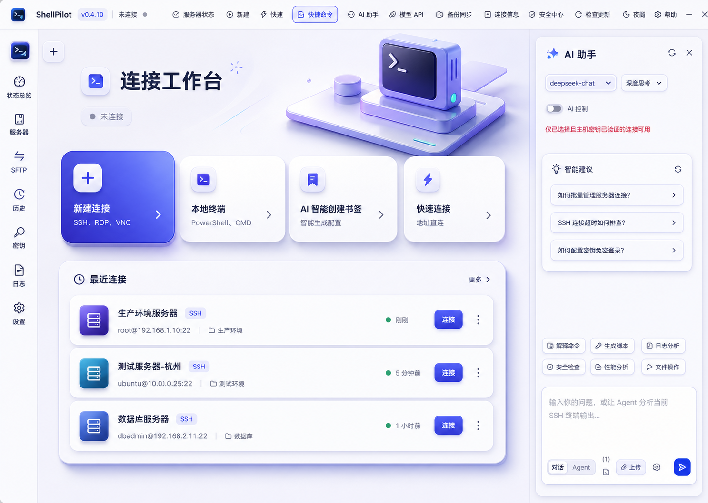

### 5.2 状态总览

- 保留已保存服务器数量、搜索、分组、状态筛选、刷新全部、刷新选中、检查服务和 AI 诊断。
- 保留当前表格列、选择行为、刷新行为和空状态。
- 表格只给主容器和选中行使用明显阴影。

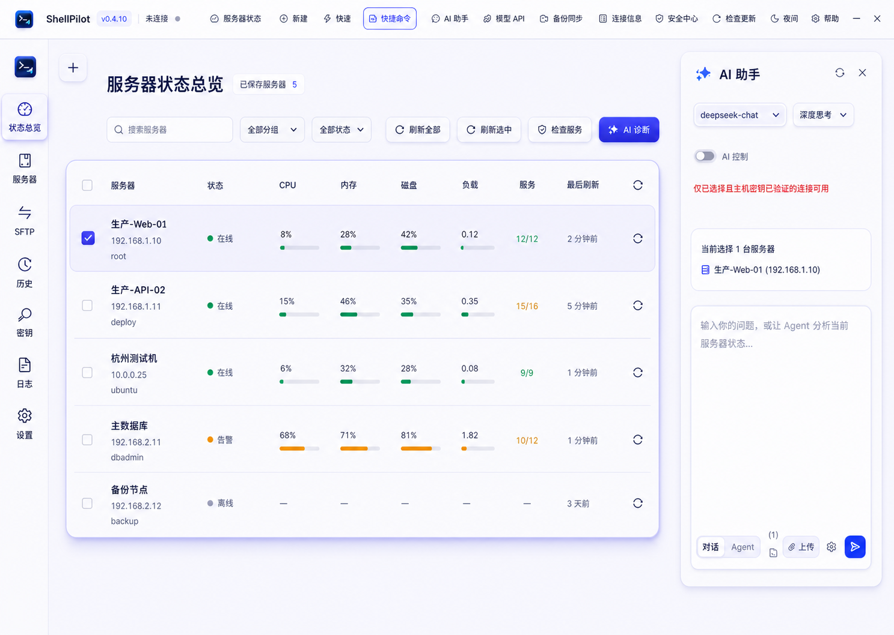

### 5.3 AI 产物

- 保留搜索、服务器筛选、格式筛选、产物列表、选择、预览/编辑、保存到本地、外部打开、上传到当前服务器、刷新和关闭。
- 保留当前文档与表格预览组件，不改自动保存和版本逻辑。
- 以修正后的预览图为准，左侧选中项为 AI 产物。

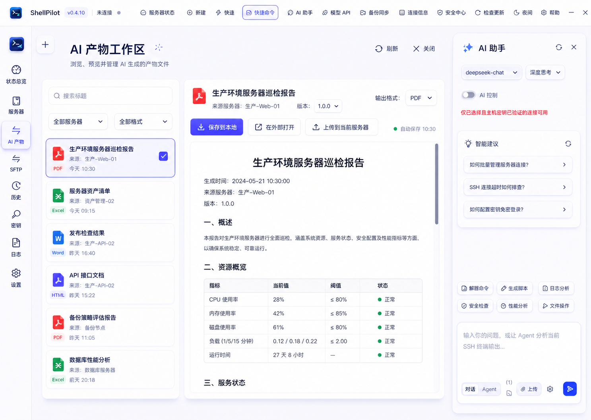

### 5.4 服务器

- 当前服务器入口打开书签/服务器侧栏时，保持该容器和交互，不改成新路由。
- 保留搜索、分组、收藏、导入、导出、新建、编辑、移动、删除、连接和上下文菜单等当前能力与可见条件。
- 全页预览只用于表格、选中态、分组和按钮的视觉参考。

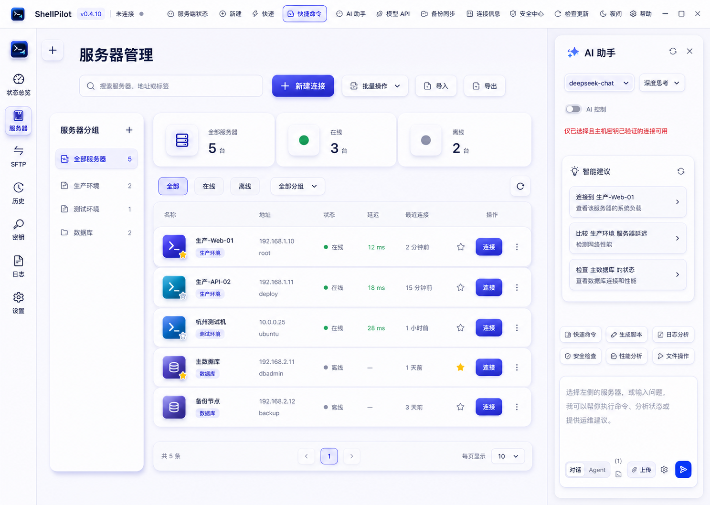

### 5.5 终端

- 保留现有标签页、会话工具栏、终端画布、终端/SFTP 切换、搜索、重连、分屏、状态栏和 AI 助手。
- 终端背景、字体、字号、光标和主题继续尊重用户设置。
- 强阴影只包围终端主容器；终端字符本身不加辉光。

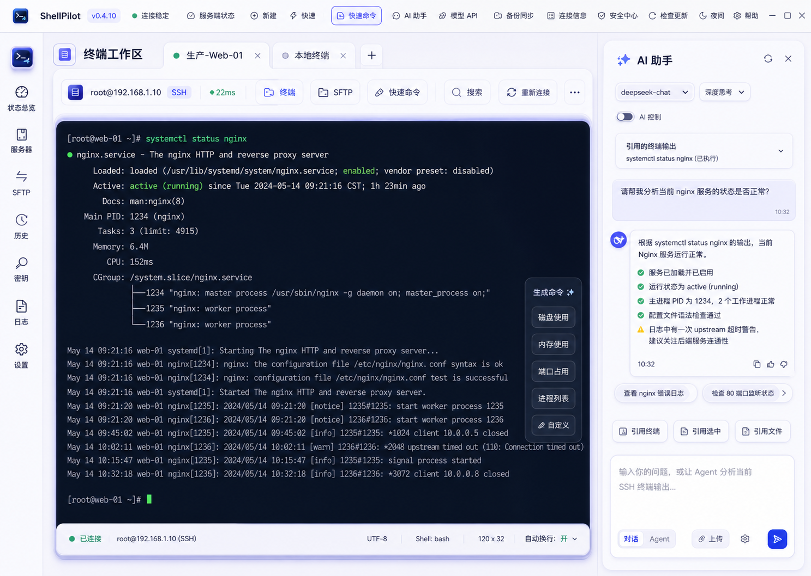

### 5.6 SFTP

- 保留本地/远程双栏、地址栏、导航、搜索、排序、选择、上传、下载、文件操作、传输队列和安全事务行为。
- 不改变双击、右键、拖拽、多选、快捷键和路径跟随逻辑。
- 文件行保持扁平，选中行和传输进度使用主题色。

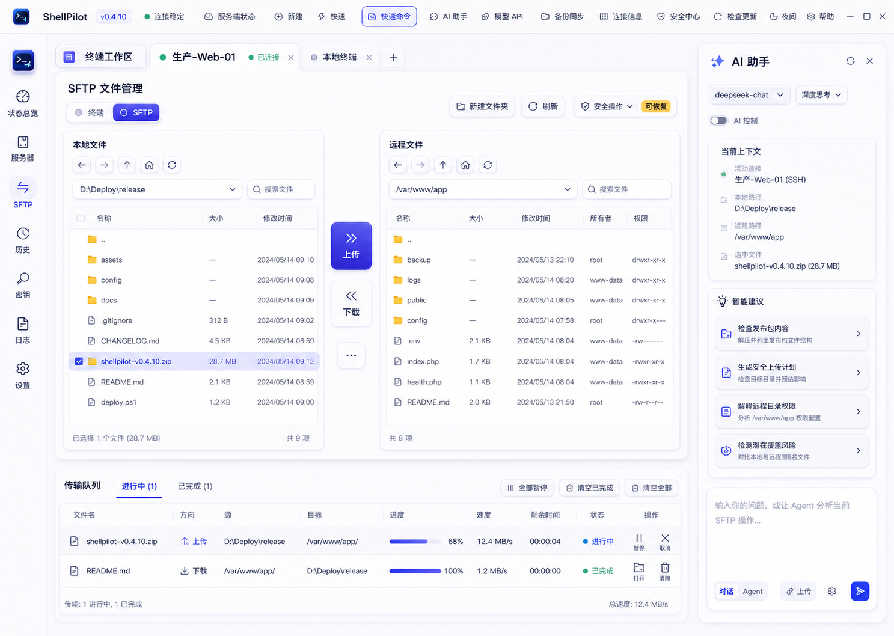

### 5.7 历史

- 保持历史为现有侧栏面板，不改成全页。
- 只保留当前按频率排序、清空、选择连接、创建书签和删除操作。
- 不增加搜索、日期筛选、统计或分组。

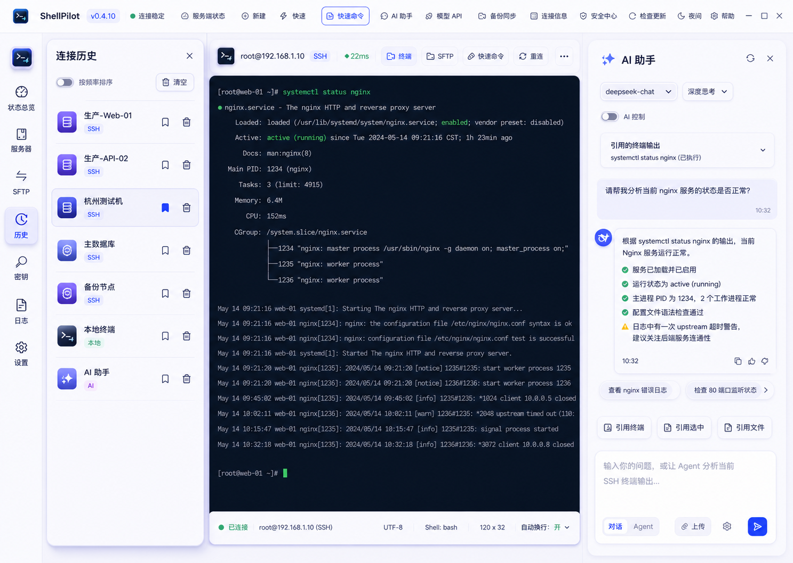

### 5.8 密码管理

- 保持从密钥入口进入设置中心的当前行为。
- 保留按密码分组、搜索关联连接、遮罩显示、数量、关联主机、复制和修改密码。
- 不增加生成、导入、导出、删除、显示明文、轮换或安全评分。

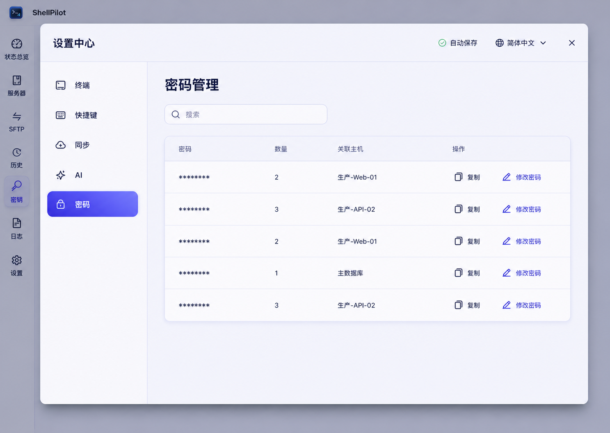

### 5.9 日志

- 保持当前信息弹窗、标签结构和关闭行为。
- 日志内容继续使用现有数据源和渲染逻辑。
- 不增加搜索、筛选、导出、复制、刷新或清空操作。

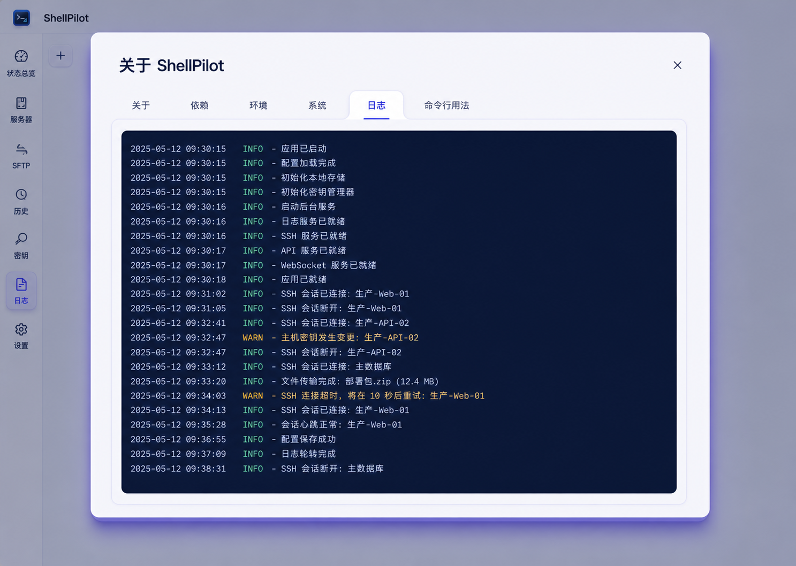

### 5.10 设置

- 保留设置中心搜索、自动保存、语言预览/应用、关闭、分类和全部字段顺序。
- 保留通用、终端、快捷键、同步、AI、密码等当前分类及条件性内容。
- 设置项以分组和分隔线为主，不让每个字段成为独立卡片。

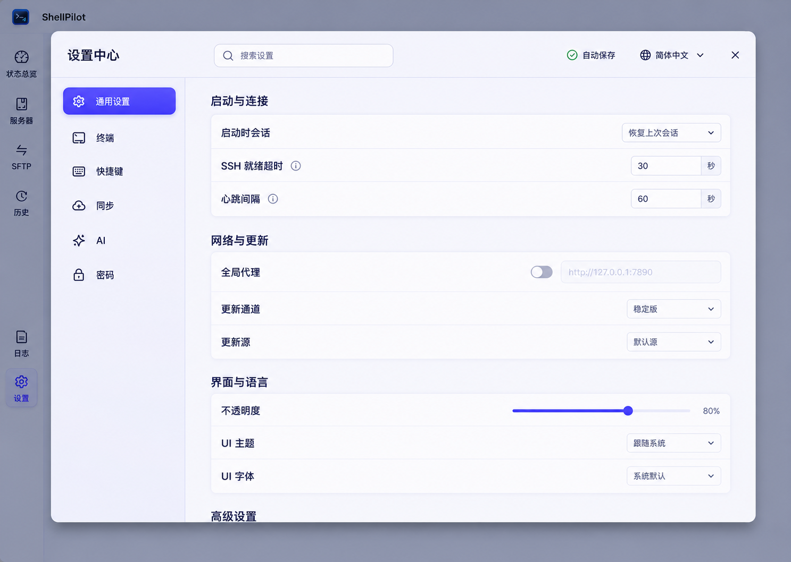

### 5.11 快速命令 / 运维工具箱

- 保留快速操作、只读诊断、安全维护、我的工具、历史五个标签及顺序。
- 保留推荐诊断流程、工具目录、搜索、分类、参数、连接状态、执行、任务、结果、取消和 AI 分析交接。
- 不改变只读与有副作用操作的安全确认、事务和回滚机制。

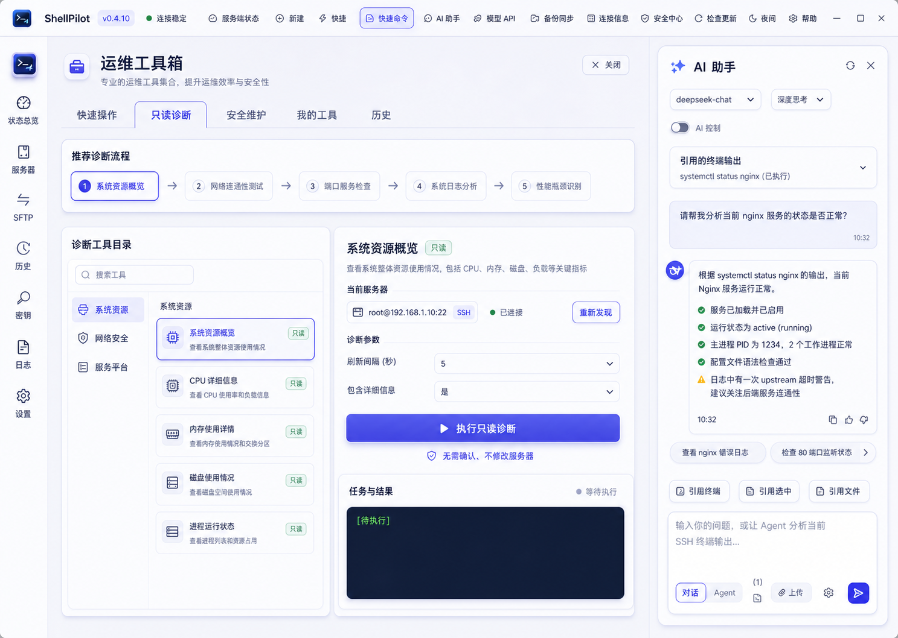

## 6. 实现边界

优先通过现有 Stylus 主题层、CSS 变量和组件样式实现。推荐将共享令牌集中在主题入口，再按壳层、列表/表格、表单、弹窗、终端/SFTP、AI 面板分层应用。

JSX 只允许以下非功能性改动：

- 添加样式 className。
- 添加不影响语义、焦点和事件冒泡的展示包装层。
- 将重复的纯展示样式提取为现有组件可复用的视觉组件。

不得修改事件处理器、状态读取、条件分支、store、数据请求或组件公开接口。若样式必须依赖新状态才能实现，则放弃该效果或先单独请求批准。

## 7. 可访问性与尺寸

- 文本和背景普通内容至少达到 WCAG AA 4.5:1；大文字至少 3:1。
- 键盘焦点必须始终可见。
- 1366×768、1920×1080 和 Windows 125% 缩放下不得遮挡主操作。
- 支持当前侧栏固定/非固定、AI 面板开/关、终端/SFTP 分屏和设置弹窗状态。
- 不改变现有 ARIA、tabIndex、快捷键和屏幕阅读器行为。

## 8. 验证与验收

### 功能保真

- 现有单元测试和端到端测试全部通过。
- 对比改动前后可见入口、标签、按钮、菜单和设置字段，数量与顺序一致。
- 搜索、连接、终端输入、SFTP、AI、设置自动保存、安全确认和回滚流程行为一致。
- 不出现新的 store 字段、API、IPC、持久化键或业务状态。

### 视觉验收

- 11 个一级工作区共享同一套颜色、圆角、阴影和排版令牌。
- 主操作、选中态和容器层级清晰；普通数据行不过度卡片化。
- 浅色与深色主题均无低对比度、裁切、溢出或焦点丢失。
- 与本规格的预览图逐页对照；结构差异必须来自“保留当前功能/容器”的要求，而不是遗漏。

### 回归截图

- 1366×768：浅色、深色。
- 1920×1080：浅色、深色。
- 125% 缩放：主页、设置、终端、SFTP、AI 面板打开状态。

## 9. 非目标

- 不重构业务组件。
- 不新增页面、路由、数据面板或 AI 能力。
- 不改变品牌名称、产品文案或信息架构。
- 不在本设计阶段实现代码、发布版本或调整打包配置。
